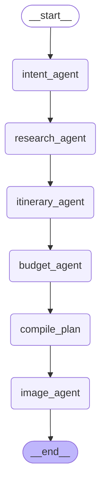
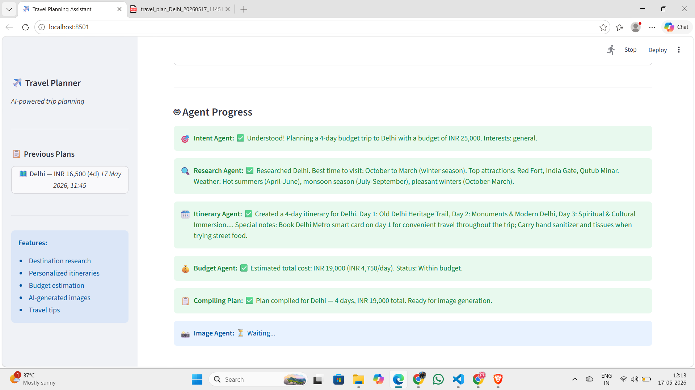
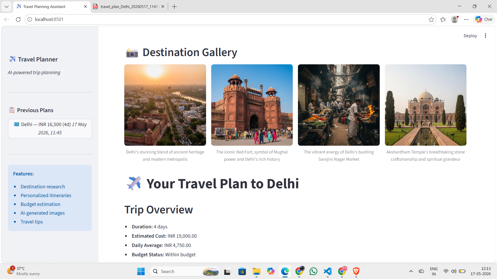
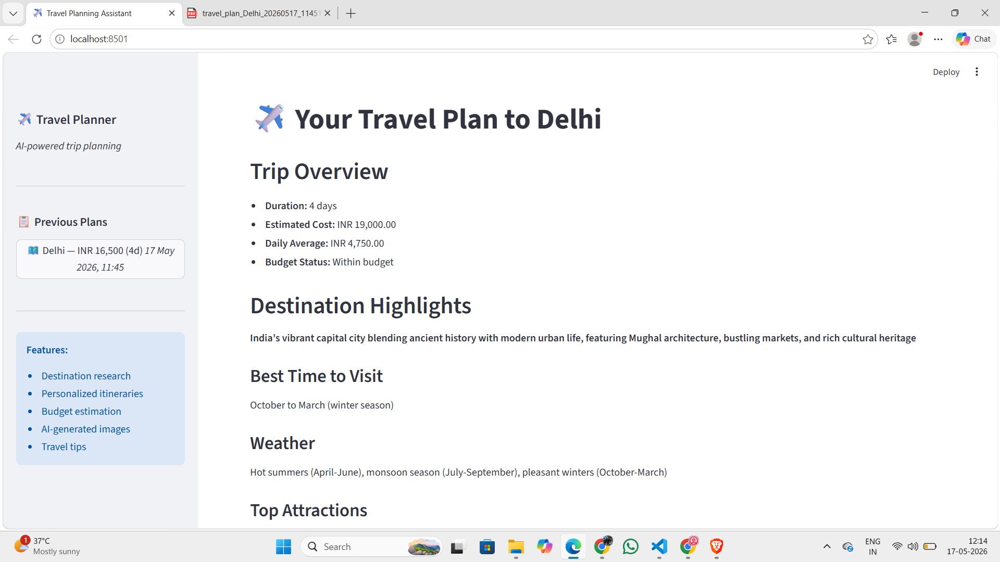

# Travel Planning Assistant

An AI-powered travel planning system using LangGraph, Anthropic, Gemini, and Streamlit.

## 🏗️ Architecture

The system uses a **sequential multi-agent pipeline** orchestrated by LangGraph. Each agent receives the output of the previous one via a shared state object (`TravelPlanState`).



## 📋 Agents

| # | Agent | Responsibility |
|---|-------|---------------|
| 1 | **Intent Agent** | Parses user input — extracts destination, budget, duration, currency, travel style, interests |
| 2 | **Research Agent** | Fetches real destination data (weather, attractions, entry requirements) via APIs |
| 3 | **Itinerary Agent** | Builds a day-wise plan with timed activities, meal suggestions, accommodation |
| 4 | **Budget Agent** | Estimates total cost per category in the user's currency; checks against budget |
| 5 | **Orchestrator** | LangGraph `StateGraph` — manages data flow between all agents |
| 6 | **Image Agent** | Generates photorealistic destination images using Google Gemini *(bonus)* |

## 🚀 Quick Start

### Prerequisites

- Python 3.11+
- [Anthropic API key](https://console.anthropic.com/)
- [API Ninjas key](https://api-ninjas.com/) — for weather, city, and currency data
- [Google AI key](https://aistudio.google.com/) — for Gemini image generation

### Installation

1. Clone the repository
```bash
git clone <repo-url>
cd travel-planner
```

2. Create virtual environment
```bash
python -m venv venv
venv\Scripts\activate   # Windows
source venv/bin/activate # Mac/Linux
```

3. Install dependencies
```bash
pip install -r requirements.txt
```

4. Set up environment variables
```bash
cp .env.example .env
# Edit .env and fill in your API keys
```

### Running the Application

#### Streamlit UI (recommended)
```bash
streamlit run ui/streamlit_app.py
```

#### CLI Mode
```bash
python main.py
```

## 🐳 Docker

```bash
# Build
docker build -t travel-planner .

# Run
docker run -p 8501:8501 \
  -e ANTHROPIC_API_KEY=your_key \
  -e API_NINJAS_KEY=your_key \
  -e GOOGLE_API_KEY=your_key \
  travel-planner
```

Open `http://localhost:8501`

## 🖼️ Sample Outputs

### Agent Progress — Live Streaming UI


### AI-Generated Destination Gallery


### Final Travel Plan


### 📄 Sample Generated PDFs

Sample travel plan PDFs for Delhi and North East India are available in the [`assets/`](assets/) folder.

## 🎯 Key Features

- Multi-agent collaboration with real inter-agent data dependency
- Live streaming agent progress in the UI
- Real API data (API Ninjas + Wikipedia) — no hardcoded content
- Smart currency detection (₹, $, €, £, k/lac shorthand)
- Budget status calculated in code, not by the LLM
- PDF + JSON download of the final plan
- AI-generated destination images (Google Gemini)
- Session history in sidebar

## 📁 Project Structure

```
travel-planner/
├── agents/
│   ├── intent_agent.py      # Extracts trip details
│   ├── research_agent.py    # Fetches destination info
│   ├── itinerary_agent.py   # Generates day-wise plan
│   ├── budget_agent.py      # Estimates costs
│   └── image_agent.py       # Generates images (Gemini)
├── graph/
│   └── __init__.py          # LangGraph StateGraph workflow
├── models/
│   └── schemas.py           # Pydantic data models
├── tools/
│   ├── __init__.py          # API Ninjas + Wikipedia tools
│   └── pdf_generator.py     # PDF export
├── ui/
│   └── streamlit_app.py     # Streamlit frontend
├── config.py                # API keys + agent config
├── main.py                  # CLI entry point
├── Dockerfile
└── requirements.txt
```

## 🔧 Technology Stack

| Layer | Technology |
|-------|-----------|
| Orchestration | LangGraph (StateGraph) |
| LLM | Anthropic Claude (claude-sonnet-4) |
| Image Generation | Google Gemini |
| Research Tools | API Ninjas, Wikipedia REST API |
| UI | Streamlit |
| Data Models | Pydantic v2 |
| Language | Python 3.11+ |

## 👤 Author

P.V.S.S Sathwick
